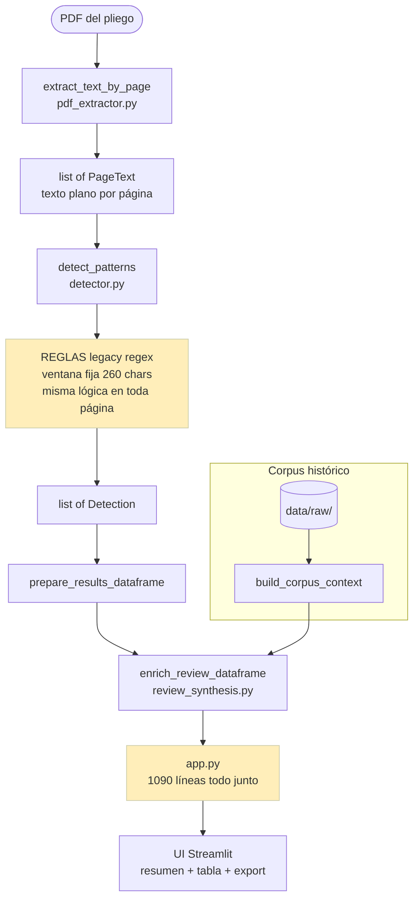
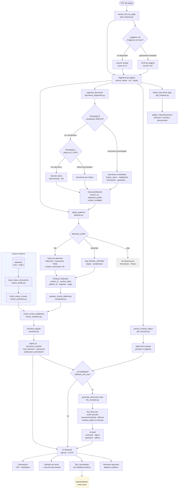

# Asistente exploratorio de neutralidad competitiva en pliegos

Aplicación exploratoria local para apoyar la revisión humana de neutralidad competitiva en pliegos de contratación pública.

La herramienta ayuda a priorizar y contextualizar señales preliminares de restricción competitiva, requisitos potencialmente limitantes, baja neutralidad competitiva y condiciones que podrían reducir concurrencia.

Las señales identificadas son insumos preliminares para revisión humana de neutralidad competitiva. No constituyen dictamen técnico, legal ni determinación de responsabilidad.

## Stack

- Python 3.11+
- Streamlit
- PyMuPDF (fitz)
- pandas
- OpenAI SDK v2 (OpenAI directo o Azure OpenAI)
- python-dotenv

## Estructura

```text
.
├── assets
│   └── styles.css
├── app.py
├── data
│   ├── raw
│   │   ├── metadata
│   │   │   └── procesos.csv
│   │   ├── pliegos
│   │   └── especificaciones
│   └── processed
│       └── extracted_text
├── requirements.txt
├── README.md
└── src
    └── analyzer
        ├── corpus_loader.py
        ├── corpus_validator.py
        ├── __init__.py
        ├── detector.py
        ├── finding_model.py
        ├── llm_reviewer.py
        ├── normative_reference.py
        ├── pdf_extractor.py
        ├── patterns
        │   ├── __init__.py
        │   ├── competitive_neutrality_patterns.py
        │   └── risk_taxonomy.yaml
        ├── prioritizer.py
        ├── taxonomy_loader.py
        └── review_synthesis.py
```

## Instalación local

```bash
python3 -m venv .venv
source .venv/bin/activate   # Windows: .venv\Scripts\activate
pip install -r requirements.txt
```

## Configuración

Copia `.env.example` como `.env` y completa las variables según tu proveedor:

**Opción A — OpenAI directo**
```text
OPENAI_API_KEY=sk-...
OPENAI_MODEL=gpt-4o-mini
OPENAI_BASE_URL=
OPENAI_API_VERSION=
```

**Opción B — Azure OpenAI**
```text
OPENAI_API_KEY=<tu-azure-key>
OPENAI_MODEL=gpt-4o-mini
OPENAI_BASE_URL=https://<tu-recurso>.openai.azure.com/
OPENAI_API_VERSION=2024-06-01
```

La capa LLM es opcional. Si no configuras credenciales la app funciona con reglas, taxonomía YAML y comparación documental.

## Ejecución

```bash
streamlit run app.py
```

Luego abre:

```text
http://localhost:8501
```

## Enfoque analítico

La interfaz se presenta como:

```text
Asistente exploratorio de neutralidad competitiva en pliegos
```

Subtítulo:

```text
Identificación preliminar de requisitos potencialmente limitantes en documentos de contratación pública
```

La herramienta ayuda a responder:

```text
¿Qué condiciones del pliego podrían requerir validación de proporcionalidad o revisión humana sugerida por posible efecto sobre concurrencia?
```

La experiencia principal está organizada como una lectura vertical tipo briefing institucional. Los controles analíticos principales se mantienen en la vista central:

- carga del documento
- selección de comparación con corpus histórico
- activación de lectura asistida por IA
- pipeline visual
- lectura preliminar
- criterios de lectura
- temas sugeridos para revisión
- evidencia documental

La barra lateral queda reservada para configuración técnica opcional, como `Test LLM`.

## Diagrama de flujo

### Antes (pipeline original — Initial commit)

Flujo plano: todas las páginas tratadas igual, sin secciones, sin tipo de documento, sin feedback.



### Ahora (pipeline actual — Fases 0–5)

Pipeline estructurado: extracción tipada, segmentación por secciones, detección con perfil por sección, trazabilidad completa, lectura IA opcional, feedback loop.



### Qué cambió etapa a etapa

| Etapa | Antes | Ahora |
|-------|-------|-------|
| Extracción | texto plano, sin tipo ni source | `PageText.source` (native/ocr/empty), `detect_document_type()`, OCR opcional |
| Segmentación | **no existía** | `segment_document()` — 8 secciones, `detection_profile`, `context_multiplier` |
| Detección | ventana fija 260 chars, sin perfil | ventanas dinámicas por patrón × sección; formularios skipped; restricted en condiciones |
| Hallazgos | sin `section_id` | `section_id`, `section_label`, `taxonomy_sha256`, `signal_id` en cada fila |
| LLM | modelo inválido, prompt genérico | few-shots dinámicos, taxonomía filtrada, sección de origen, `contract_object` en brief |
| Arquitectura | `app.py` 1090 líneas | 8 módulos en `src/ui/` + `src/pipeline/`; `app.py` ~165 líneas |
| Tests | 0 | 33 tests (taxonomía, priorización, segmentador, E2E pipeline) |

### Próximos pasos sugeridos

| Prioridad | Tarea | Esfuerzo |
|-----------|-------|---------|
| Alta | **Estrategia C — visual blocks**: usar `page.get_text("dict")` para detectar secciones por tamaño de fuente y bold en PDFs nativos digitales; requiere agregar `blocks` a `PageText` | ~1 jornada |
| Alta | **OCR activable desde UI**: checkbox en sidebar + `attempt_ocr=True` en `extract_text_by_page()`; contador de páginas OCR-candidatas visible | ~0.5 jornada |
| Media | **Corpus de muestra real**: cargar 10–20 pliegos SERCOP reales en `data/raw/` para que la comparación histórica tenga base estadística significativa | ~1 jornada |
| Media | **Few-shot por sección**: `_select_few_shots()` considera `section_id` además de `tipo_señal`; agregar `FEWSHOT_EXPERIENCIA_ESPECIFICA` para sección `experiencia_capacidad` | ~0.5 jornada |
| Media | **Reporte PDF**: generar el reporte ejecutivo como PDF descargable además de Markdown; usar `weasyprint` o `reportlab` | ~1 jornada |
| Baja | **API REST**: exponer `/analyze` como endpoint FastAPI para integración con otros sistemas institucionales | ~2 jornadas |
| Baja | **Evaluación automática**: script que corre el pipeline sobre el corpus y mide precision/recall contra un conjunto de señales anotadas manualmente | ~2 jornadas |

## Categorías de revisión

- Autorizaciones comerciales o de fabricante
- Referencias a marca, origen o fabricante
- Certificaciones específicas
- Requisitos técnicos cerrados
- Garantías, repuestos y postventa
- Restricciones geográficas o de presencia local
- Experiencia o capacidad excesivamente específica
- Combinaciones de requisitos potencialmente limitantes
- Completitud y trazabilidad documental
- Requisitos regulatorios o habituales
- Elementos que favorecen concurrencia

## Evaluación contextual

El motor ya no trata toda coincidencia textual como señal prioritaria. Cada detección se clasifica con `tipo_señal`:

- `señal_revision`: aspecto que podría requerir revisión humana por posible impacto sobre concurrencia.
- `mitigante_concurrencia`: elemento que favorece apertura competitiva o reduce una lectura cerrada.
- `requisito_habitual`: requisito regulatorio, administrativo o estándar que no se prioriza por sí solo.

Ejemplos de requisitos regulatorios o habituales:

- RUP
- capacidad legal
- domicilio fiscal
- asociaciones y consorcios
- personas naturales o jurídicas
- documentación administrativa estándar

Estos requisitos no suben atención automáticamente y no aparecen en el Top 3 salvo que una combinación contextual específica justifique revisión.

Ejemplos de mitigantes:

- aceptación de equivalentes funcionales
- participación mediante consorcios
- apertura a oferentes nacionales y extranjeros
- marcas equivalentes
- criterios funcionales en vez de referencias cerradas

Los mitigantes reducen la atención contextual de señales relacionadas y se muestran como aspectos que favorecen apertura competitiva.


## Taxonomía de patrones documentales

La app incorpora una taxonomía editable en `src/analyzer/patterns/risk_taxonomy.yaml`. Esta taxonomía permite ajustar patrones documentales sin modificar código Python. Cada patrón define dimensión competitiva, señales textuales, señales semánticas, posibles indicadores, mitigantes, justificaciones legítimas, preguntas de revisión humana y lenguaje recomendado.

El loader `src/analyzer/taxonomy_loader.py` valida campos obligatorios y aplica fallback seguro si el YAML falta o contiene errores parciales. La herramienta conserva compatibilidad con el catálogo Python inicial en `src/analyzer/patterns/competitive_neutrality_patterns.py`.

La diferencia metodológica central es que una señal preliminar no equivale a una conclusión legal o técnica. El motor preserva evidencia y contexto para revisión humana: equivalencias, justificaciones cercanas, acumulación de condiciones y frecuencia histórica.

Los mitigantes no eliminan automáticamente una señal. La contextualizan. Por ejemplo, una mención a marca con “o equivalente” se mantiene como aspecto revisable, pero con menor prioridad y con una pregunta sobre si la equivalencia es efectiva y verificable.

## Modelo estructurado de hallazgos

La app incorpora una capa estructurada de hallazgos mediante `src/analyzer/finding_model.py`, alimentada por la taxonomía YAML y el catálogo inicial de respaldo.

Cada hallazgo conserva:

- identificador trazable
- `pattern_id` y `pattern_name`
- dimensión competitiva
- sección documental probable
- severidad prudente: `low`, `medium` o `contextual`
- evidencia textual y página
- razón de revisión
- factores mitigantes
- posibles justificaciones legítimas
- información faltante
- preguntas sugeridas
- prioridad de revisión: `general`, `suggested` o `priority`
- advertencia metodológica

Los resultados son preliminares, no constituyen dictamen legal o técnico definitivo y no reemplazan la revisión humana.

## Capa normativa orientativa

La herramienta incluye una capa simple de referencia normativa para alinear las observaciones con principios y reglas relevantes de contratación pública en Ecuador.

Principios y criterios considerados:

- concurrencia
- igualdad y no discriminación
- trato justo
- transparencia
- mejor valor por dinero
- claridad, completitud y no ambigüedad de especificaciones
- especificaciones relacionadas con bienes/rubros y no con proveedores
- necesidad de justificación técnica o jurídica cuando un requisito pueda limitar competencia
- consistencia entre pliego y anexos
- uso adecuado de CPC

Por cada señal sugerida para revisión, la app agrega:

- `principio_normativo_relacionado`
- `criterio_normativo_de_revision`
- `pregunta_normativa_sugerida`

La referencia normativa incluida es orientativa y sirve para apoyar revisión humana. No constituye interpretación legal oficial ni reemplaza el análisis jurídico o técnico de la entidad competente.

Fuentes de referencia:

- LOSNCP, disponible en el portal normativo del SERCOP: https://portal.compraspublicas.gob.ec/sercop/normativa/
- RLOSNCP, disponible en el portal normativo del SERCOP: https://portal.compraspublicas.gob.ec/sercop/normativa/
- Resoluciones SERCOP vigentes y régimen de transición, cuando aplique: https://portal.compraspublicas.gob.ec/sercop/cat_normativas/nor_res_ext

## Salida principal

Cada señal sugerida para revisión incluye:

- `signal_id`
- `rule_id`
- `pattern_id`
- `pattern_name`
- dimensión competitiva
- sección documental probable
- prioridad de revisión
- confidence
- `rule_version`
- `timestamp_analisis`
- `engine_version`
- `tipo_señal`
- tema de revisión
- página
- categoría de revisión
- patrón detectado
- atención sugerida
- relevancia analítica
- criterios de priorización
- explicación de priorización
- clasificación histórica
- frecuencia en corpus
- procesos con patrón
- posible efecto sobre concurrencia
- validación sugerida
- principio normativo relacionado
- criterio normativo de revisión
- pregunta normativa sugerida
- por qué se sugiere revisar
- posible justificación legítima
- fragmento textual

## Priorización

El módulo `src/analyzer/prioritizer.py` agrega una priorización explicable. No calcula un indicador acusatorio; organiza señales para responder qué revisar primero y por qué.

Campos principales:

- `nivel_atencion`: Bajo, Medio o Alto, usado como etiqueta de atención visual
- `review_priority`: `general`, `suggested` o `priority`
- `prioridad de revisión`: revisión general, revisión sugerida o revisión prioritaria
- `relevancia_analitica`: Bajo, Medio o Alto
- `criterios_de_priorizacion`: razones concretas usadas por el motor
- `explicacion_priorizacion`: síntesis prudente para revisión humana

La atención sugerida combina:

- frecuencia histórica del patrón
- concentración de señales relacionadas
- nivel de atención base de la regla
- presencia de combinaciones potencialmente limitantes
- presencia en secciones críticas
- número de coincidencias
- completitud documental y referencias a anexos externos
- criterios normativos asociados
- factores mitigantes identificados en el documento

No se priorizan requisitos regulatorios estándar como RUP, domicilio fiscal, capacidad legal o fórmulas generales de participación, salvo combinación contextual específica.

La atención sube cuando aparecen combinaciones como:

- autorización comercial o de fabricante + certificación específica
- marca/fabricante + requisito técnico cerrado
- distribuidor autorizado + garantía/postventa
- certificación específica + baja frecuencia en corpus
- requisito técnico cerrado + baja frecuencia histórica

## Niveles de atención

- **Alto:** conviene revisar primero por baja frecuencia, acumulación de condiciones, combinación de requisitos o posible impacto relevante sobre concurrencia.
- **Medio:** requiere validación de proporcionalidad, justificación técnica o equivalencias disponibles.
- **Bajo:** señal habitual o de menor concentración; se mantiene como apoyo documental y puede adquirir relevancia si aparece combinada con otros requisitos.

## Corpus histórico integrado

La comparación histórica se integra automáticamente en cada señal sugerida para revisión.

La herramienta prioriza trazabilidad documental, reproducibilidad y auditabilidad por encima de conveniencia automática. Por defecto no realiza matching por similitud, coincidencias parciales ni inferencias por `process_id`.

Estructura esperada:

```text
data/
  raw/
    metadata/
      procesos.csv
    pliegos/
    especificaciones/
  processed/
    extracted_text/
```

`data/raw/metadata/procesos.csv` debe incluir:

```text
process_id
entidad
objeto
fecha
pliego_file
especificaciones_file
```

## Convención obligatoria de nombres

Los campos `pliego_file` y `especificaciones_file` deben apuntar al nombre del PDF ubicado en la carpeta exacta correspondiente:

- `pliego_file` se busca solo en `data/raw/pliegos/`
- `especificaciones_file` se busca solo en `data/raw/especificaciones/`

Normalización estricta aplicada por `normalize_filename()`:

- elimina espacios iniciales y finales
- elimina dobles espacios
- reemplaza espacios por `_`
- elimina caracteres invisibles
- convierte el nombre base a mayúsculas de forma consistente
- normaliza la extensión como `.pdf`

Ejemplos válidos:

```text
process_id,pliego_file,especificaciones_file
SIE-EMASEO-EP-2026-006,SIE-EMASEO-EP-2026-006_PLIEGO.pdf,SIE-EMASEO-EP-2026-006_ESPECIFICACIONES.pdf
LICB-EMASEO-EP-2025-001,LICB-EMASEO-EP-2025-001_PLIEGO.pdf,LICB-EMASEO-EP-2025-001_ESPECIFICACIONES.pdf
```

Errores comunes:

- declarar un PDF en `procesos.csv` que no existe físicamente
- ubicar especificaciones en la carpeta de pliegos o al revés
- usar extensión distinta de `.pdf`
- repetir `process_id`
- referenciar el mismo PDF en más de un proceso
- dejar campos obligatorios vacíos
- dejar PDFs en carpetas del corpus sin correspondencia en `procesos.csv`

## Validación documental del corpus

El módulo `src/analyzer/corpus_validator.py` valida antes de cargar documentos:

- PDFs faltantes
- nombres inconsistentes
- `process_id` duplicados
- documentos repetidos
- extensiones inválidas
- metadata incompleta
- archivos huérfanos
- documentos sin correspondencia CSV

La app muestra la sección `Estado del corpus documental` con:

- total de documentos esperados
- encontrados
- faltantes
- inconsistencias
- duplicados
- errores de naming

La tabla de validación incluye:

- `process_id`
- `tipo_documento`
- `archivo_esperado`
- `archivo_encontrado`
- `estado_validacion`
- `observacion`

Estados posibles:

- `OK`
- `No encontrado`
- `Nombre inconsistente`
- `Duplicado`
- `Metadata incompleta`
- `Coincidencia ambigua`
- `Documento sin correspondencia CSV`

Si el corpus tiene errores críticos como PDF faltante, coincidencia ambigua, duplicados graves o metadata incompleta, la app bloquea la comparación histórica y muestra:

```text
El corpus presenta inconsistencias documentales que podrían afectar la trazabilidad y confiabilidad del análisis.
```

Los PDFs huérfanos se reportan, pero no se cargan automáticamente.

Cada documento cargado guarda trazabilidad:

- `document_id`
- `process_id`
- path exacto
- filename original
- filename normalizado
- SHA256
- timestamp de carga
- tamaño del archivo

El cache incremental se reutiliza solo si el SHA256 del PDF coincide con el registro procesado.

Para agregar nuevos procesos:

1. Copia el PDF del pliego en `data/raw/pliegos/`.
2. Copia el PDF de especificaciones técnicas en `data/raw/especificaciones/`, si existe.
3. Actualiza `data/raw/metadata/procesos.csv`.
4. Ejecuta nuevamente la revisión desde la app.

La ingesta es incremental. Por cada documento procesado se crea un JSON en:

```text
data/processed/extracted_text/
```

## Lectura asistida por IA

La capa de IA generativa es opcional. Si no configuras una API key, la app sigue funcionando con reglas, comparación documental, filtros y exportación CSV.

Para configurarla:

```bash
export OPENAI_API_KEY="tu_api_key"
streamlit run app.py
```

También puedes crear un archivo `.env` (ver sección **Configuración** más arriba para las opciones OpenAI y Azure OpenAI).

En la app:

- usa `Test LLM` para verificar conexión
- marca `Activar lectura asistida por IA` para generar la lectura preliminar
- usa `Generar explicación asistida por IA` en una señal puntual si necesitas una explicación adicional

La lectura asistida por IA:

- usa máximo 12.000 caracteres del documento
- prioriza fragmentos vinculados a señales sugeridas
- recibe señales priorizadas, categorías, atención sugerida, taxonomía documental y frecuencias comparativas
- recibe mitigantes y requisitos habituales como contexto de balance
- recibe criterios normativos orientativos curados
- no debe proponer señales nuevas sin soporte en el análisis previo
- usa la capa normativa como referencia prudente, sin emitir dictámenes legales
- debe distinguir requisitos habituales, señales atípicas y elementos que favorecen concurrencia

Funciones principales:

- `generate_document_brief(document_text, prioritized_findings, corpus_context, normative_context)`
- `explain_priority_with_llm(priority)`

La salida del brief incluye:

- resumen del documento
- nivel general de atención
- principales temas de revisión
- posibles efectos sobre concurrencia
- contexto comparativo
- razones de las prioridades principales
- preguntas sugeridas para revisión humana
- nota metodológica

## Módulos principales

| Módulo | Descripción |
|--------|-------------|
| `src/analyzer/text_cleaner.py` | Normalización unificada: `clean_page_text()` para display/export, `normalize_for_matching()` para comparaciones internas con soporte de acentos vía NFD |
| `src/analyzer/pdf_extractor.py` | Extracción por página con PyMuPDF; incluye `extract_contract_object()`, `detect_document_type()` y soporte OCR opcional con pytesseract |
| `src/analyzer/document_segmenter.py` | Segmentación estructural: `segment_document()` detecta secciones del pliego (especificaciones, habilitación, formularios, etc.) con `detection_profile` y `context_multiplier` por sección |
| `src/analyzer/detector.py` | Detección de patrones con ventanas de contexto dinámicas y `section_id` en cada hallazgo; secciones `skip` no producen detecciones |
| `src/analyzer/prioritizer.py` | Priorización explicable con trazabilidad completa (signal_id, taxonomy_sha256, engine_version) |
| `src/analyzer/llm_reviewer.py` | Cliente LLM agnóstico: detecta Azure OpenAI si `OPENAI_API_VERSION` está configurado; few-shots dinámicos y taxonomía filtrada por señal |
| `src/analyzer/taxonomy_loader.py` | Carga y valida `risk_taxonomy.yaml`; `taxonomy_sha256()` para trazabilidad; fallback seguro si falta el archivo |
| `src/analyzer/corpus_loader.py` | Ingesta incremental de corpus con SHA256 y trazabilidad |
| `src/ui/components.py` | Constantes compartidas (`EXPORT_COLUMNS`, `LLM_COLUMNS`) y helpers de UI (`safe_text`, `attention_badge`) |
| `src/ui/cache.py` | Wrappers `@st.cache_data` para LLM y corpus |
| `src/ui/briefing.py` | Resumen ejecutivo, balance analítico, dimensiones competitivas |
| `src/ui/findings.py` | Tarjetas de señal, Top 3 prioridades, feedback buttons |
| `src/ui/export.py` | Export CSV ordenado y reporte ejecutivo en Markdown |
| `src/pipeline/coordinator.py` | Coordinación del pipeline: DataFrame, corpus status, páginas extraídas |

## Tests

La suite cubre carga de taxonomía, fallback seguro, normalización de texto, acentos, mitigantes, señales contextuales, priorización y control de lenguaje en outputs principales.

```bash
pytest
```

## Estado del desarrollo

Ver `docs/roadmap.md` para el diagnóstico completo y fases detalladas.

### Completado

- [x] Modelo LLM corregido (`gpt-4o-mini`)
- [x] Soporte Azure OpenAI: detección automática por `OPENAI_API_VERSION`
- [x] `.env.example` documenta las 4 variables (OpenAI directo y Azure)
- [x] `test_llm_connection()` verifica respuesta exacta "OK"
- [x] Corpus de muestra: `data/raw/metadata/procesos.csv` con 5 procesos ficticios
- [x] `src/analyzer/text_cleaner.py`: normalización unificada con NFD para acentos
- [x] Ventanas de contexto dinámicas por tipo de patrón en `detector.py`
- [x] `extract_contract_object()` en `pdf_extractor.py`
- [x] Exportación CSV limpia: `clean_export_dataframe()` aplica `clean_page_text()` al fragmento textual

### Completado — Fase 2 (calidad del LLM)

- [x] `SYSTEM_PROMPT` actualizado: lector objetivo explícito (técnico institucional, 30 min, orientado a decisión)
- [x] 4 few-shots canónicos en `llm_reviewer.py`: marca sin equivalente, marca con equivalente, requisito habitual, presencia local
- [x] `_select_few_shots()`: selección dinámica por tipo de señal y presencia de mitigantes
- [x] `_relevant_taxonomy_context()`: taxonomía filtrada al patrón relevante (~300 tokens vs ~2000 antes)
- [x] `extract_contract_object()` conectado al prompt del brief (reemplaza "No disponible")

### Completado — Fase 3 (robustez)

- [x] `PageText.source`: registra `"native"`, `"ocr"` o `"empty"` por página
- [x] `_page_needs_ocr()`: detecta páginas con imágenes pero sin texto nativo
- [x] `extract_text_by_page(attempt_ocr=True)`: OCR opcional via pytesseract si está instalado
- [x] `detect_document_type()`: detecta pliego / especificaciones técnicas / términos de referencia / contrato
- [x] Tipo de documento mostrado en la UI y en el CSV exportado (`tipo_documento`)
- [x] `render_feedback_buttons()`: 3 botones (Confirmar / Descartar / Más contexto) en cada tarjeta de señal
- [x] Feedback grabado en `data/feedback/cases.jsonl` (gitignored)
- [x] `taxonomy_sha256()`: SHA256 del YAML activo incluido en cada hallazgo exportado

### Completado — Fase 4 (arquitectura)

- [x] `app.py` refactorizado de ~1090 a ~165 líneas: solo orquestación, sin renderizado ni exportación
- [x] `src/ui/components.py`: constantes y helpers compartidos (`safe_text`, `attention_badge`, `EXPORT_COLUMNS`, etc.)
- [x] `src/ui/cache.py`: wrappers `@st.cache_data` para LLM y corpus
- [x] `src/ui/header.py`: `render_institutional_header()`, `render_pipeline()`
- [x] `src/ui/briefing.py`: `render_briefing()`, `render_ai_document_brief()`, `render_analytical_balance()`
- [x] `src/ui/findings.py`: `render_aspect_card()`, `render_top_priorities()`, `render_theme_groups()`, `render_feedback_buttons()`
- [x] `src/ui/export.py`: `ordered_export()`, `build_executive_report_markdown()`
- [x] `src/pipeline/coordinator.py`: `prepare_results_dataframe()`, `render_corpus_status()`, `validate_extracted_pages()`
- [x] `@lru_cache(maxsize=1)` reemplaza `_TAXONOMY_CACHE` global mutable en `detector.py`
- [x] `pytest` movido a `requirements-dev.txt`; `pyproject.toml` con configuración de pytest
- [x] Test E2E (`tests/test_e2e_pipeline.py`): PDF sintético → detección → enriquecimiento → priorización; 9 asserts de trazabilidad. **21 tests totales pasan.**

### Completado — Fase 5 (parsing estructural)

- [x] `src/analyzer/document_segmenter.py`: `DocumentSection` dataclass + `segment_document()` con cascada de estrategias
- [x] `SECTION_VOCABULARY`: 8 tipos de sección de pliegos SERCOP (objeto, habilitación, especificaciones técnicas, experiencia, garantías, criterios, condiciones generales, formularios)
- [x] `detection_profile` por sección: `"full"` / `"restricted"` / `"skip"` — formularios producen cero detecciones
- [x] `context_multiplier` por sección: hasta 1.8× en especificaciones técnicas para capturar equivalencias lejanas
- [x] `detect_patterns(pages, sections=None)`: acepta secciones; si no se pasan, segmenta automáticamente con fallback
- [x] `section_id` y `section_label` en cada `Finding`/`Detection`, en el CSV exportado y en el contexto del LLM
- [x] 12 tests en `tests/test_document_segmenter.py`. **33 tests totales pasan.**

## Exportaciones

La app permite descargar:

- CSV con señales consolidadas, priorización, trazabilidad, contexto histórico y criterios normativos.
- Reporte ejecutivo en Markdown con lectura preliminar, Top 3 prioridades, señales agrupadas, evidencia textual, nota metodológica y advertencia institucional.

## Validaciones y control

La app muestra mensajes comprensibles cuando detecta:

- PDF sin texto seleccionable
- páginas sin texto extraído
- OCR requerido, no disponible en esta versión
- metadata de corpus faltante
- PDFs del corpus no encontrados
- API key no configurada
- error o timeout del proveedor LLM

## Referencias conceptuales y metodológicas

La arquitectura conceptual, los principios analíticos, el enfoque metodológico y los lineamientos de gobernanza de esta herramienta se documentan en:

- [docs/technical_and_conceptual_framework.md](docs/technical_and_conceptual_framework.md)

Este documento incluye:

- enfoque de neutralidad competitiva;
- principios de prudencia analítica, revisión humana y trazabilidad;
- estrategia de corpus histórico;
- arquitectura conceptual;
- uso prudente de IA generativa;
- mitigación de falsos positivos;
- gobernanza y lineamientos de evolución futura.

La herramienta constituye un ejercicio exploratorio de apoyo analítico documental y no reemplaza revisión técnica, jurídica o institucional.

## Advertencia institucional

Las señales identificadas son insumos preliminares para revisión humana de neutralidad competitiva. No constituyen dictamen técnico, legal ni determinación de responsabilidad.

## Limitaciones

- Usa reglas textuales y comparación documental exploratoria.
- No reemplaza análisis técnico, jurídico ni operativo.
- La capa IA puede fallar por falta de credenciales, red, cuota o respuesta inválida.
- PDFs escaneados podrían requerir OCR en una versión posterior.
