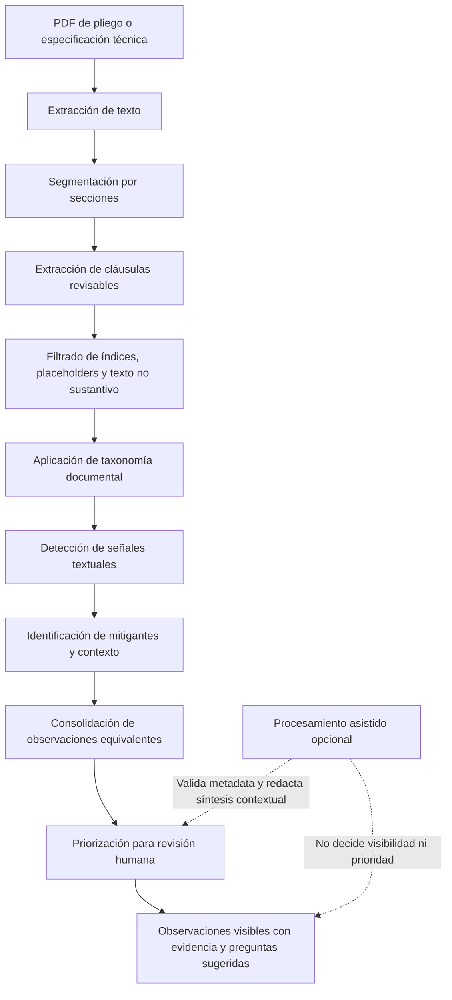

# Integrity Tool

Herramienta exploratoria para revisión documental preliminar de pliegos y especificaciones técnicas en contratación pública.

Integrity Tool ayuda a organizar evidencia, identificar observaciones preliminares y priorizar revisión humana sobre posibles condiciones que podrían afectar concurrencia, proporcionalidad o neutralidad competitiva.

No detecta corrupción, no determina ilegalidad, no asigna responsabilidades y no reemplaza revisión técnica, jurídica ni institucional.

## Objetivo

La herramienta busca responder:

> ¿Qué aspectos de este pliego convendría revisar primero y por qué?

Para eso combina extracción documental, reglas determinísticas, una taxonomía editable de señales y, cuando está configurado, procesamiento asistido para redactar resúmenes o explicaciones contextuales.

## Cómo funciona

El flujo principal es determinístico:

1. Extrae texto del PDF con PyMuPDF y usa OCR como respaldo si está disponible.
2. Segmenta el documento en secciones y cláusulas revisables.
3. Filtra texto no sustantivo, placeholders, índices y boilerplate.
4. Aplica una taxonomía YAML de señales documentales.
5. Detecta mitigantes como equivalencias, justificaciones técnicas o requisitos regulatorios habituales.
6. Consolida observaciones equivalentes para evitar duplicados.
7. Prioriza revisión humana como `revisión general`, `revisión sugerida` o `revisión prioritaria`.
8. Muestra evidencia textual y visual asociada a cada observación.

El LLM es opcional. Si existe una clave o proveedor configurado, se usa solo como capa de apoyo para validar metadata, redactar lectura preliminar y contextualizar observaciones ya detectadas. No agrega ni elimina observaciones por decisión propia.

### Cursograma general



## Qué analiza

La herramienta puede revisar PDFs de pliegos y especificaciones técnicas. La taxonomía actual incluye señales relacionadas con:

- referencias a marcas, modelos, tecnologías o fabricantes;
- requisitos de autorización, certificación, trazabilidad o respaldo del bien;
- especificaciones técnicas altamente prescriptivas;
- experiencia o capacidad potencialmente excesiva;
- requisitos financieros potencialmente restrictivos;
- cronogramas, plazos de preguntas, ofertas, entrega o ejecución;
- visitas técnicas obligatorias;
- restricciones territoriales o presencia local;
- interoperabilidad, compatibilidad o continuidad operativa;
- documentación administrativa excesiva;
- alineamiento de especificaciones con presentaciones, modelos, SKU o productos comerciales específicos.

Estas dimensiones son una propuesta metodológica inicial y pueden ajustarse mediante la taxonomía.

## Instalación

macOS / Linux:

```bash
python3 -m venv .venv
source .venv/bin/activate
pip install -r requirements.txt
cp .env.example .env
```

Windows PowerShell:

```powershell
py -m venv .venv
.\.venv\Scripts\Activate.ps1
python -m pip install -r requirements.txt
copy .env.example .env
```

Si PowerShell bloquea la activación del entorno virtual, ejecutar una vez:

```powershell
Set-ExecutionPolicy -Scope CurrentUser RemoteSigned
```

La aplicación funciona sin configurar un LLM. En ese caso se muestran resultados basados en reglas, taxonomía y comparación documental local cuando exista corpus disponible.

OCR en Windows es opcional. Solo hace falta instalar Tesseract si se van a analizar PDFs escaneados como imagen. Para PDFs con texto seleccionable no es necesario.

## Ejecución Local

```bash
python -m streamlit run app.py
```

Luego abra la URL local que indique Streamlit, usualmente `http://localhost:8501`.

Usar `python -m streamlit` evita problemas de rutas internas del entorno virtual en Windows, macOS y Linux.

## Configuración LLM Opcional

Edite `.env` solo si desea habilitar procesamiento asistido.

OpenAI directo:

```env
OPENAI_API_KEY=...
OPENAI_MODEL=gpt-4o-mini
```

Azure OpenAI:

```env
OPENAI_API_KEY=...
OPENAI_BASE_URL=https://your-resource.openai.azure.com/
OPENAI_API_VERSION=2024-06-01
OPENAI_MODEL=gpt-4o-mini
```

Groq:

```env
GROQ_API_KEY=...
GROQ_MODEL=llama-3.3-70b-versatile
```

Ollama local:

```env
OLLAMA_BASE_URL=http://localhost:11434/v1
OLLAMA_MODEL=llama3.1
```

## Corpus Documental Opcional

Para comparar contra procesos previamente analizados se puede usar esta estructura:

```text
data/
  raw/
    metadata/
      procesos.csv
    pliegos/
    especificaciones/
  processed/
    extracted_text/
```

El CSV `procesos.csv` puede incluir:

- `process_id`
- `entidad`
- `objeto`
- `fecha`
- `pliego_file`
- `especificaciones_file`

Los archivos en `data/` no se versionan por defecto. Esto evita publicar PDFs o corpus locales accidentalmente.

## Estructura Principal

```text
app.py
assets/styles.css
pages/Ayuda.py
src/analyzer/
  detector.py
  prioritizer.py
  llm_reviewer.py
  observation_filter.py
  schedule_analyzer.py
  patterns/risk_taxonomy.yaml
docs/
  architecture.md
  technical_and_conceptual_framework.md
tests/
```

Los archivos `agent.py`, `agent_runner.py`, `db.py` y `tools.py` corresponden a capacidades experimentales de procesamiento batch. No son necesarios para ejecutar la demo Streamlit.

## Validación

```bash
python -m compileall app.py src tests pages
pytest -q
```

Estado de referencia de esta rama: `57 passed`.

## Referencias conceptuales y metodológicas

La arquitectura conceptual, los principios analíticos, el enfoque metodológico y los lineamientos de gobernanza se documentan en:

- [Marco técnico y conceptual](docs/technical_and_conceptual_framework.md)
- [Arquitectura del pipeline documental](docs/architecture.md)

Estos documentos explican el enfoque de neutralidad competitiva, trazabilidad, revisión humana, corpus histórico, uso prudente de LLM y mitigación de falsos positivos.

## Alcance

Integrity Tool es una herramienta exploratoria de apoyo analítico documental. Sus observaciones son insumos preliminares para revisión humana y deben interpretarse junto con el expediente, normativa aplicable, mercado relevante, necesidad institucional y criterio técnico-jurídico competente.

No es una herramienta oficial del SERCOP ni representa una posición institucional.
