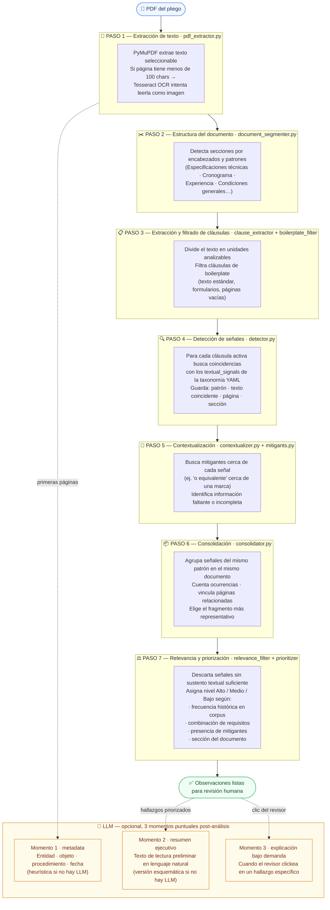

# Asistente exploratorio de neutralidad competitiva en pliegos — Branch `fusion`

Aplicación local para apoyar la revisión humana de neutralidad competitiva en pliegos de contratación pública de Ecuador.

> **Branch `fusion`**: integración de lo mejor de los branches `Andres`, `Sebastian` y `Vladimiro`, con correcciones y mejoras adicionales. Los tres branches originales se conservan sin modificación.

---

## Cómo funciona el análisis

**El motor de detección es 100% reglas duras — no usa ningún modelo de IA.**

Todo lo que genera las observaciones (detectar señales, priorizar, filtrar) corre con una taxonomía de patrones en un archivo YAML editable. Es determinístico, rápido, sin GPU, sin API, sin costo por análisis.

El LLM es **opcional** y entra solo en 3 momentos, **después** de que el análisis ya terminó.



---

## Dos caminos de análisis: con y sin modelo

La herramienta puede operar de dos formas según si hay un LLM configurado o no.  
**Las señales detectadas son siempre las mismas** — el LLM no cambia los hallazgos, solo agrega lectura narrativa encima de ellos.

### Camino A — Solo reglas duras (sin LLM)

El análisis completo corre con YAML + Python. No requiere API, no tiene costo por uso, es 100% determinístico.

Lo que produce cada señal:

```
Patrón:     marca
Señal:      "distribuidor autorizado"
Fragmento:  "Los equipos deberán ser marca SIEMENS, distribuidor autorizado en Ecuador"
Página:     12
Mitigantes: []
Prioridad:  Medio
```

El revisor ve el fragmento, la página, el patrón detectado y el nivel de atención. No hay narrativa. Tiene que interpretar el hallazgo por su cuenta.

### Camino B — Reglas duras + LLM

El mismo análisis de reglas corre primero, sin cambios. Después el LLM entra en **3 momentos puntuales**:

#### Momento 1 — Metadata (primeras páginas → LLM)

Sin LLM la metadata se extrae por heurística de texto (regex y patrones de posición).  
Con LLM el modelo recibe las primeras páginas + los candidatos heurísticos y los valida:

```json
// Heurística sola:
{ "entidad_contratante": { "value": "DEBERÁ SER ENTIDAD DE...", "confidence": "baja" } }

// Con LLM:
{ "entidad_contratante": { "value": "Municipio de Santo Domingo de los Tsáchilas",
                           "confidence": "alta",
                           "evidence": "Encabezado pág 1: 'GAD Municipal Santo Domingo...'" } }
```

El LLM corrige truncamientos, detecta si el valor es en realidad una cláusula y no un nombre, y normaliza el tipo de procedimiento.

#### Momento 2 — Resumen ejecutivo (hallazgos priorizados → LLM)

Sin LLM el encabezado muestra conteo de señales por nivel (Alto / Medio / Bajo) y lista de temas.  
Con LLM el modelo recibe el extracto del documento + todos los hallazgos ordenados por prioridad + contexto normativo, y genera:

```
// Sin LLM:
Alto: 2  Medio: 5  Bajo: 3
Temas: marca, experiencia específica, cronograma restringido

// Con LLM:
"El documento presenta 3 patrones acumulados de restricción competitiva en la
sección de especificaciones técnicas: referencia de marca sin equivalente funcional,
experiencia en marca específica y certificación no estándar en el mismo lote.
La combinación justifica revisión prioritaria de proporcionalidad antes de publicar.
Las condiciones de cronograma parecen razonables para el monto estimado."
```

El modelo usa los few-shots `_FEWSHOT_MARCA_SIN_EQUIVALENTE` / `_FEWSHOT_MARCA_CON_EQUIVALENTE` para calibrar el tono: no acusatorio, orientado a decisión, distingue requisitos habituales de señales atípicas.

#### Momento 3 — Explicación on-demand (clic del revisor → LLM)

Sin LLM el hallazgo muestra: fragmento, página, patrón, prioridad, preguntas de revisión sugeridas del YAML.  
Con LLM, cuando el revisor hace clic en "Leer con IA", el modelo recibe ese hallazgo específico + contexto histórico del patrón y genera:

```
// Sin LLM (campo "por qué se sugiere revisar" del YAML):
"Referencia de marca comercial sin equivalente funcional explícito."

// Con LLM:
Explicación:  "La especificación nombra marca SIEMENS con requisito de distribución
              autorizada en Ecuador, sin incluir cláusula de aceptación de equivalentes.
              Esto limita de facto la competencia a los distribuidores autorizados de
              esa marca en el territorio, independientemente de si otros productos
              cumplen las mismas especificaciones técnicas."

Por qué importa: "La combinación marca + distribuidor autorizado + sin equivalente
                 es una señal acumulada de restricción. Justifica revisar si la
                 entidad tiene justificación técnica o historial de compatibilidad
                 que respalde la exigencia."

Acción sugerida: "Verificar si existe cláusula de equivalencia funcional en otro
                apartado. Si no existe, solicitar justificación técnica documentada."

Preguntas:  ["¿El pliego incluye en algún punto una cláusula de aceptación de
             equivalentes funcionales?",
             "¿Existe justificación técnica de la exigencia de esta marca?"]
```

El few-shot que usa el modelo depende de si la señal tiene mitigantes: con mitigantes usa el ejemplo de "marca con equivalente → atención baja"; sin mitigantes usa "marca sin equivalente → revisión prioritaria". Esto calibra al modelo para que no sobre-alarme cuando el pliego ya incluyó la cláusula de equivalencia.

### Resumen de diferencias

| | Solo reglas | Con LLM |
|---|---|---|
| Señales detectadas | ✅ Igual en ambos casos | ✅ Igual en ambos casos |
| Metadata del documento | Heurística (puede truncarse o errar) | Validada con evidencia textual |
| Resumen ejecutivo | Conteo y lista de temas | Narrativa interpretativa contextual |
| Explicación de hallazgo | Campo del YAML ("por qué revisar") | Texto en lenguaje natural orientado a decisión |
| Costo | $0 por análisis | Por llamada API (Groq tiene plan gratuito) |
| Determinismo | 100% (mismo doc = mismo resultado) | No determinístico (puede variar leve) |
| Velocidad | Inmediato | ~2-5s adicionales (metadata + brief) |

> El LLM nunca agrega ni elimina señales. Si el YAML detecta 7 hallazgos, el revisor ve 7 hallazgos con o sin modelo. La diferencia es si esos hallazgos vienen con narrativa interpretativa o solo con los campos estructurados del YAML.

---

## De dónde vienen las reglas duras

Las reglas de detección tienen **dos fuentes**, con prioridad clara:

### Fuente 1 (principal): `risk_taxonomy.yaml`
Archivo YAML de ~2000 líneas con **19 patrones** editables sin tocar código. Cada patrón define:

| Campo | Qué hace |
|-------|----------|
| `textual_signals` | Términos que activan la señal (ej. `"distribuidor autorizado"`, `"marca"`) |
| `mitigating_factors` | Términos que reducen la prioridad (ej. `"o equivalente"`) |
| `escalation_factors` | Combinaciones que suben la prioridad (ej. marca + certificación + baja frecuencia) |
| `competition_dimension` | Dimensión competitiva asociada (neutralidad, proporcionalidad, barreras…) |
| `severity_guidance` | Nivel base: `general`, `suggested` o `priority` |
| `human_review_questions` | Preguntas sugeridas al revisor humano |

Para agregar o ajustar un patrón: editar el YAML y relanzar la app. Sin tocar Python.

### Fuente 2 (respaldo): `competitive_neutrality_patterns.py`
Catálogo Python de ~190 líneas, con los mismos patrones en formato dict. **Solo se usa si el YAML no carga** (archivo faltante, error de sintaxis). Es un seguro de operación, no una fuente paralela.

> **¿Por qué existían los dos?** El catálogo Python fue el origen del proyecto. El YAML se introdujo para que los patrones fueran editables sin código. El Python quedó como fallback. En operación normal el YAML es lo único que corre.

### Reglas globales en `detector.py`
Además del YAML, el detector tiene tres listas hardcodeadas que aplican a **todos** los patrones:

- `GLOBAL_MITIGATING_TERMS` — términos que siempre reducen prioridad (`"o equivalente"`, `"consorcios"`, `"equivalente funcional"`, …)
- `GLOBAL_JUSTIFICATION_TERMS` — justificaciones legítimas universales (`"según normativa aplicable"`, `"por continuidad operativa"`, …)
- `GOODS_PROCUREMENT_TERMS` — contexto de bienes regulados donde ciertos requisitos son habituales (`"registro sanitario"`, `"BPM"`, `"trazabilidad"`, …)

---

## Dos funciones de detección (y cuándo se usa cada una)

Hay dos funciones en `detector.py` que no son lo mismo:

| Función | Usada por | Qué hace |
|---------|-----------|----------|
| `detect_signals(clauses)` | Pipeline principal · Streamlit UI | Opera sobre cláusulas ya clasificadas. Solo usa YAML. Es el camino principal. |
| `detect_patterns(pages)` | Modo agente · `tools.py` · tests | Opera sobre páginas crudas. Usa YAML + reglas RULES (mitigantes y habituales del catálogo Python). Deduplica si un término aparece en ambas fuentes. |

En la práctica: la UI usa `detect_signals`, el agente batch usa `detect_patterns`. Los resultados son equivalentes porque el YAML es la fuente dominante en ambos casos.

---

## Qué aportó cada branch

### Branch `Sebastian`
Base técnica principal adoptada en `fusion`:

- **Pipeline clause-centric**: PDF → parse → segment → extract_clauses → boilerplate_filter → detect_signals → contextualize → consolidate → relevance_filter → prioritize → ReviewItems
- **`observation_filter.py`**: agrupa hallazgos por `(pattern_id + competition_dimension + signal_type)`, cuenta ocurrencias, vincula páginas relacionadas y aplica visibility scoring
- **Suite de 47 tests** que cubre taxonomía, mitigantes, señales contextuales, priorización y control de lenguaje
- Arquitectura modular con separación clara entre detección, consolidación, priorización y renderizado

### Branch `Andres`
Capacidades de modo agente adoptadas en `fusion`:

- **`agent.py` / `agent_runner.py`**: modo batch para procesar múltiples pliegos sin interfaz Streamlit
- **`db.py`**: persistencia en SQL Server vía pyodbc; campo allowlist `_AGENT_RUN_UPDATABLE_FIELDS` para prevenir inyección SQL en UPDATE dinámico
- **`notifier.py`**: envío de alertas por email SMTP con informe HTML de hallazgos
- **`tools.py`**: herramientas de agente para extracción de texto y detección de patrones
- **`pages/Ayuda.py`**: página de ayuda integrada en Streamlit
- **Soporte Groq**: `GROQ_API_KEY` y `GROQ_MODEL` para usar `llama-3.3-70b-versatile` u otros modelos del ecosistema Groq
- **OCR con Tesseract** (`pdf_extractor.py`): extractor enriquecido con fallback OCR para PDFs escaneados; si Tesseract no está instalado marca páginas como `requires_ocr` sin interrumpir el análisis

### Branch `Vladimiro`
Experiencia de usuario y capa LLM adoptadas en `fusion`:

- **Few-shots en el prompt LLM**: `_FEWSHOT_MARCA_SIN_EQUIVALENTE` y `_FEWSHOT_MARCA_CON_EQUIVALENTE` para calibrar la lectura asistida
- **Encabezado de documento con resumen analítico**: señales Alto/Medio/Bajo, temas principales y objeto del proceso visibles desde el primer pantallazo
- **UI en tabs**: organización de la vista de resultados por pestañas
- **CSS limpio y variables definidas**: primera versión con `--surface`, `--shadow-soft`, `--text-muted` en `:root`
- **Configuración flexible por env**: `OPENAI_BASE_URL`, `OPENAI_MODEL` y fallback seguro cuando no hay LLM configurado

---

## Qué se mejoró en `fusion`

### Soporte multi-proveedor LLM
- Cadena de detección automática: **Azure OpenAI → Groq → Ollama → OpenAI directo**
- Variable `LLM_PROVIDER` para forzar proveedor: `groq`, `azure`, `ollama`, `openai`
- `_forced_provider()` correctamente conectado a `_use_azure/groq/ollama/openai()`
- `_response_format()`: esquema `json_schema` (strict) para cloud, `json_object` para Ollama
- `_call_with_retry()`: backoff exponencial, MAX_RETRIES=4, BASE_DELAY=2.0 para rate limit 429
- `test_llm_connection()` usado consistentemente (antes solo se chequeaba `OPENAI_API_KEY`)
- `src/config.py` con `GROQ_MODEL`, `OLLAMA_BASE_URL`, `OLLAMA_MODEL`

### Pipeline correctamente cableado
- `observation_filter.prepare_visible_review_items()` existía en Sebastian pero **nunca se llamaba**; ahora está integrado en `review_pipeline.py` y se retorna como `enriched_df`
- `tools.py` (Andres): `detect_patterns()` ahora usa el pipeline clause-centric completo igual que la UI, en vez de una función separada que fue removida

### Refactor de utilidades duplicadas
- **`src/analyzer/text_utils.py`** (nuevo): `unique_strings`, `list_field`, `normalize_text_es`, `is_substantive_evidence_text`, `has_concrete_requirement_detail`, `looks_like_structural_text` — antes duplicadas en 6+ módulos del pipeline
- **`src/analyzer/review_row_schema.py`** (nuevo): constantes para todos los nombres de campo del row (`SIGNAL_ID`, `PATTERN_NAME`, `REVIEW_PRIORITY_LABELS`, `HISTORY_ORDER`, etc.) con fuente única
- Eliminadas `_unique()`, `_escalation_factors()`, `_catalog_severity()` locales de `detector.py` y equivalentes en `consolidator`, `prioritizer`, `observation_filter`, `mitigants`

### CSS consolidado
- Eliminadas 2 definiciones duplicadas de `:root` → 1 bloque unificado con todas las variables
- Eliminadas 3 definiciones de `.block-container` → 1 definitiva: `max-width: 1180px; padding: 0.85rem 2rem 3rem`
- Eliminadas 2 definiciones de `h2, h3` → 1 sin border-bottom (limpia; `.section-heading` maneja sus separadores)
- Eliminadas 2 definiciones de `.document-header-simple` → 1 consolidada con `border-radius: 6px` y `box-shadow`
- Eliminada segunda definición de `.top-finding-card` que sobreescribía el borde de color azul
- Eliminada segunda definición de `.evidence-snippet` que destruía la paleta dorada de evidencia
- Añadidas variables `--surface-muted: #F8FAFC` y `--text-muted: #5F6B76` al `:root` principal

### OCR para PDFs escaneados
- `pdf_extractor.py` reemplazado por la versión de Andres con soporte Tesseract
- Flujo: PyMuPDF primero → si página < 100 chars intenta OCR (español + inglés, 300 DPI) → si Tesseract no está instalado marca `requires_ocr` y sigue sin crashear
- `PageStatus` enum: `OK`, `OCR_OK`, `OCR_FAILED`, `REQUIRES_OCR`, `EMPTY`
- `ExtractionResult`: metadata completa de extracción (totales, páginas con OCR, disponibilidad de Tesseract)
- `check_tesseract_setup()`: diagnóstico con instrucciones de instalación por OS
- API 100% compatible: `extract_text_by_page()` sigue retornando `list[PageText]`; los campos nuevos tienen defaults
- Instalación: `pip install pytesseract Pillow` + binario del sistema (`brew install tesseract tesseract-lang` / `apt install tesseract-ocr tesseract-ocr-spa`)

### Envío de informe por email desde la UI
- Panel **"Compartir por email"** al pie de los resultados, junto al export CSV
- Campo de destinatarios (uno o varios separados por coma) + botón "Enviar informe"
- Si `SMTP_USER`/`SMTP_PASSWORD` no están en `.env`: muestra hint amigable con instrucciones, no bloquea
- Si están configurados: envía informe HTML con nivel de atención, resumen, temas y top 3 hallazgos
- Usa `notifier.send_alert_email()` — compatible con Gmail (contraseña de app) y cualquier servidor SMTP con TLS
- También disponible en modo batch desde `agent.py`

### UX y experiencia de uso
- **Barra de navegación integrada** (`render_review_nav`): reemplaza el botón "Nueva revisión" flotante y desconectado por una barra horizontal con nombre del documento y botón `← Nueva revisión` a la derecha
- `render_methodological_limitations()` se mueve **antes** de los hallazgos (entre resumen y aspectos sugeridos) para que el usuario vea el alcance antes de los resultados
- Expander "Qué revisa la herramienta" abre `expanded=True` por defecto
- Resultado vacío cambia de `st.success` a `st.info` (semánticamente correcto)
- Explicación de **Alto / Medio / Bajo** visible en el encabezado de la sección de hallazgos
- Texto "PoC" eliminado → "herramienta exploratoria"
- Negrita en `matched_text` dentro de ocurrencias relacionadas (`_highlight_matched`)
- Hover de expanders y file uploader con fondo claro (override `!important` sobre dark mode de Streamlit)

### Seguridad
- `db.py`: `_AGENT_RUN_UPDATABLE_FIELDS` (frozenset) valida nombres de columna antes de UPDATE dinámico
- `agent.py`: usa `GROQ_MODEL` desde `src/config` en vez de hardcoded
- `.env.example` documenta los 4 proveedores con instrucciones comentadas

---

## Stack

- Python 3.11+
- Streamlit
- PyMuPDF (fitz)
- pandas
- openai (compatible con Azure, Groq, Ollama y OpenAI directo)
- groq >= 0.11.0
- python-dotenv
- pytesseract + Pillow (OCR opcional, requiere binario `tesseract` en el sistema)
- pyodbc (modo agente batch, opcional)

## Instalación

```bash
python3 -m venv .venv
source .venv/bin/activate
pip install -r requirements.txt
cp .env.example .env
# editar .env con las credenciales del proveedor LLM elegido
```

## Ejecución

```bash
streamlit run app.py
```

Con proveedor específico:

```bash
LLM_PROVIDER=groq streamlit run app.py
LLM_PROVIDER=ollama streamlit run app.py
LLM_PROVIDER=azure streamlit run app.py
```

## Proveedores LLM soportados

| Proveedor | Variables requeridas | Modelo por defecto |
|-----------|---------------------|-------------------|
| Azure OpenAI | `OPENAI_API_KEY` + `OPENAI_BASE_URL` + `OPENAI_API_VERSION` | `gpt-4o` |
| Groq | `GROQ_API_KEY` | `llama-3.3-70b-versatile` |
| Ollama | `OLLAMA_BASE_URL` o `OLLAMA_MODEL` | `llama3.1` |
| OpenAI directo | `OPENAI_API_KEY` | `gpt-4o` |

Forzar proveedor: `LLM_PROVIDER=groq` (o `azure`, `ollama`, `openai`).

## Tests

```bash
pytest
# 47 tests — todos deben pasar
```

## Envío de informe por email

Configurar en `.env`:

```text
SMTP_HOST=smtp.gmail.com
SMTP_PORT=587
SMTP_USER=tu_cuenta@gmail.com
SMTP_PASSWORD=xxxx_xxxx_xxxx_xxxx   # contraseña de app Gmail, no la normal
SMTP_FROM=tu_cuenta@gmail.com
```

Desde la UI: al pie de los resultados, expander **"Compartir por email"** → ingresar destinatarios → "Enviar informe".

Desde modo batch: `agent.py` envía alertas automáticamente cuando detecta señales de alta atención.

## OCR para PDFs escaneados

Instalar Tesseract en el sistema:

```bash
# Mac
brew install tesseract tesseract-lang

# Linux
sudo apt install tesseract-ocr tesseract-ocr-spa

# Windows
# https://github.com/UB-Mannheim/tesseract/wiki
```

Sin Tesseract la app funciona igual; las páginas escaneadas se marcan como `requires_ocr` y el resto se analiza normalmente.

## Modo agente (batch)

```bash
python agent_runner.py
```

Procesa lotes de pliegos sin interfaz Streamlit. Requiere SQL Server configurado en `.env`:

```text
DB_SERVER=servidor\instancia
DB_NAME=nombre_base_datos
DB_USER=usuario
DB_PASSWORD=contraseña
```

## Estructura de módulos clave

```text
src/analyzer/
  review_pipeline.py       # orquestador principal
  text_utils.py            # utilidades de texto compartidas (nuevo en fusion)
  review_row_schema.py     # constantes de campos del row (nuevo en fusion)
  detector.py              # detección de señales clause-centric
  observation_filter.py    # deduplicación y visibility scoring
  prioritizer.py           # priorización explicable
  relevance_filter.py      # filtrado de hallazgos relevantes
  consolidator.py          # consolidación de candidatos
  contextualizer.py        # mitigantes y contexto
  llm_reviewer.py          # capa LLM multi-proveedor
  patterns/
    risk_taxonomy.yaml     # taxonomía editable de patrones
```

## Advertencia institucional

Las señales identificadas son insumos preliminares para revisión humana. No constituyen dictamen técnico, legal ni determinación de responsabilidad administrativa.
