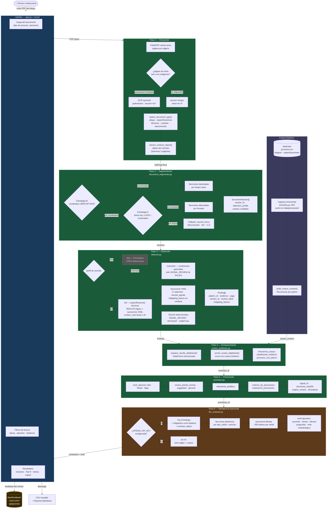

# Resumen ejecutivo de sesión — mayo 2026

**Fecha:** 14 de mayo de 2026  
**Estado:** documento de entrega de sesión

---

## Qué es el sistema

Herramienta local de apoyo a la revisión humana de neutralidad competitiva en pliegos de
contratación pública ecuatoriana. Analiza un PDF, detecta cláusulas con posible impacto sobre
la concurrencia de oferentes, las prioriza y las presenta con evidencia textual trazable.

**No es:** un sistema de decisión automática, auditoría ni dictamen legal.  
**Es:** un asistente de pre-lectura que ayuda al revisor a saber qué revisar primero.

---

## Diagrama del sistema — paso a paso



---

## Cambios realizados en esta sesión

### 1. Calibración con corpus real (Fase 6)

Se analizaron 24 procesos reales del corpus (`data/raw/`): EMASEO-EP (camiones, contenedores,
barredoras), HCAM (prótesis, implantes de columna) y HTMC (pinzas quirúrgicas, generadores
ultrasónicos). Resultados:

#### Reducción de falsos positivos

| Documento | SIGNAL_REVIEW antes | SIGNAL_REVIEW después | Reducción |
|---|---|---|---|
| LICB-EMASEO-EP-2025-001 camiones | 67 | 26 | −61% |
| SIE-HTMC-2026-040 generador ultras. | 33 | 21 | −36% |
| SIE-HTMC-2026-033 pinzas cirugía | 36 | 27 | −25% |
| SIE-HCAM-2026-051 implantes columna | 64 | 36 | −44% |

#### Cambios en `risk_taxonomy.yaml`

- **`cn-brand-model-provider-reference`**: eliminadas señales genéricas `marca`, `modelo`, `fabricante`
  (disparaban en todo texto legal). Reemplazadas por `representante autorizado`, `distribuidor exclusivo`,
  `empresa representante`, `proveedor oficial del fabricante`.

- **`cn-interoperability-lock-in`**: añadidas señales de plataforma médica:
  `plataforma compatible de energía`, `para utilizar con plataforma`, `compatible con el generador`,
  `compatible con la plataforma de energía`, `equipo existente en la institución`.

- **`cn-local-presence-requirement`**: añadidas señales de distribución local:
  `representante local`, `distribuidor local`, `empresa distribuidora`,
  `representantes locales autorizados`.

- **`cn-cumulative-requirements`**: eliminadas señales de boilerplate LOSNCP
  (`además deberá`, `adicionalmente`, `conjuntamente`). Reemplazadas por frases específicas:
  `deberá cumplir con todos los`, `cumplir con todos los siguientes requisitos`.

#### Tres nuevos patrones en la taxonomía

| Patrón | Qué detecta | Prioridad |
|---|---|---|
| `cn-medical-device-platform-lock-in` | Consumibles que exigen compatibilidad con plataforma de equipo médico instalado (ej. generadores LigaSure/Harmonic) | Alta |
| `cn-equipment-series-specific-reference` | Series o códigos de equipo instalado usados como especificación implícita de marca | Alta |
| `cn-consignment-delivery-model` | Modelo de pago por lo efectivamente utilizado que implica stock previo en la institución (ej. implantes hospitalarios) | Media |

#### Cambios en `detector.py` (RULES legacy)

- `fabricante` y `marca` convertidos a `SIGNAL_HABITUAL` — ya no generan señales de revisión prioritaria; siguen apareciendo como informativos en secciones `full`.
- Nuevas reglas `SIGNAL_HABITUAL`: `homologación ANT` (requisito regulatorio ANT Ecuador) y `norma INEN` (estándar técnico nacional).
- Contexto ampliado para nuevos patrones: `cn-medical-device-platform-lock-in` (600 chars), `cn-interoperability-lock-in` (500 chars).

#### Mejoras en `document_segmenter.py` (vocabulario hospitalario)

Añadidos términos para documentos IESS/hospitales:
- `descripcion general del requerimiento`, `descripcion del requerimiento` → `objeto_contratacion`
- `terminos de referencia`, `descripcion tecnica del bien`, `formulario de especificaciones tecnicas` → `especificaciones_tecnicas`
- `antecedentes`, `marco normativo`, `disposiciones legales` → `condiciones_generales`

---

### 2. Centralización de configuración

**Archivo nuevo:** `src/config.py` — fuente única de todos los parámetros configurables.

Lee variables de entorno con fallbacks tipados. Los módulos importan desde aquí en lugar de
tener `os.getenv()` dispersos o números mágicos.

#### Variables de `.env` ahora documentadas y usadas

| Variable | Por defecto | Módulo que la usa |
|---|---|---|
| `OPENAI_MODEL` | `gpt-4o-mini` | `llm_reviewer.py` |
| `APP_MAX_DOCUMENT_CHARS` | `12000` | `llm_reviewer.py` |
| `APP_CORPUS_METADATA_PATH` | `data/raw/metadata/procesos.csv` | `corpus_loader.py` |
| `APP_CORPUS_PLIEGOS_DIR` | `data/raw/pliegos` | `corpus_loader.py` |
| `APP_CORPUS_ESPECIFICACIONES_DIR` | `data/raw/especificaciones` | `corpus_loader.py` |
| `APP_CORPUS_PROCESSED_DIR` | `data/processed/extracted_text` | `corpus_loader.py` |
| `APP_DEFAULT_CONTEXT_CHARS` | `260` | `detector.py` |
| `APP_REPORT_TOP_PRIORITIES` | `3` | `findings.py`, `export.py` |
| `APP_LLM_TOP_FINDINGS` | `5` | `coordinator.py` |
| `APP_LLM_BALANCE_ROWS` | `8` | `coordinator.py` |

#### Módulos actualizados para usar `config.py`

- `src/analyzer/llm_reviewer.py` — ya no tiene `DEFAULT_MODEL` ni `MAX_DOCUMENT_CHARS` hardcodeados
- `src/analyzer/corpus_loader.py` — rutas del corpus desde config
- `src/analyzer/detector.py` — `_DEFAULT_CONTEXT_CHARS` desde config
- `src/pipeline/coordinator.py` — límites de findings/balance desde config
- `src/ui/findings.py` — `UI_REPORT_TOP_PRIORITIES` desde config
- `src/ui/export.py` — `UI_REPORT_TOP_PRIORITIES` desde config

---

### 3. README reescrito

El README anterior era un changelog de desarrollo. El nuevo README comunica:

1. **Para qué sirve** — problema que resuelve, usuario objetivo
2. **Cómo funciona** — diagrama ASCII del pipeline completo
3. **Instalación** — pasos mínimos
4. **Configuración** — todas las variables `.env` explicadas
5. **Cómo usar la UI** — pasos numerados para el revisor
6. **Corpus histórico** — cómo agregar documentos
7. **Taxonomía** — cómo editar patrones sin tocar código
8. **Módulos** — tabla de qué hace cada módulo
9. **Consideraciones metodológicas** — advertencias de uso responsable

---

## Arquitectura actual

```
PDF del pliego
     │
     ▼ pdf_extractor.py
PageText[] (source: native/ocr/empty)
detect_document_type() → pliego/especificaciones/términos/contrato/desconocido
extract_contract_object() → objeto del contrato (3 primeras páginas)
     │
     ▼ document_segmenter.py
DocumentSection[] → 8 tipos de sección
  Cascada: vocabulario SERCOP → títulos ALL-CAPS → fallback único
  Perfil: full | restricted | skip
  context_multiplier: 1.0–1.8×
     │
     ▼ detector.py
Finding[] / Detection[]
  Dos capas de detección:
  1. Taxonomía YAML (17 patrones, textual_signals + mitigating_factors)
  2. RULES legacy (regex deterministas, SIGNAL_REVIEW/MITIGANT/HABITUAL)
  section_id, section_label, pattern_id, page en cada hallazgo
     │
     ▼ review_synthesis.py + corpus_loader.py
Enriquecimiento con corpus histórico:
  frecuencia_corpus, clasificación_histórica, procesos_con_patron
     │
     ▼ prioritizer.py
nivel_atencion, relevancia_analitica, review_priority
signal_id, taxonomy_sha256, engine_version, timestamp
     │
    ┌┴────────────────────┐
    │ sin IA              │ con IA (opcional)
    │                     │ llm_reviewer.py
    │                     │ few-shots dinámicos
    │                     │ taxonomía filtrada ~300 tok
    │                     │ contract_object en prompt
    └──────────┬──────────┘
               │
               ▼ app.py + src/ui/
Interfaz Streamlit:
  resumen ejecutivo | balance analítico | dimensiones
  Top N señales prioritarias con feedback buttons
  señales agrupadas por tema y sección
  exportación CSV + Markdown
  feedback → data/feedback/cases.jsonl
```

---

## Casos de uso de punta a punta

### Caso 1 — Revisión rápida sin IA (modo reglas)

**Usuario:** analista institucional, 30 minutos disponibles.

1. Abre `http://localhost:8501`.
2. Carga el PDF del pliego (ej. `SIE-HTMC-2026-033_PLIEGO.pdf`).
3. Marca "Comparar con corpus histórico local" (si hay corpus cargado).
4. Deja "Activar lectura asistida por IA" **desmarcado**.
5. Presiona **Iniciar revisión asistida**.
6. Lee el **resumen ejecutivo** — cuántas señales, balance entre señales y mitigantes.
7. Revisa el **Top 3 señales prioritarias** — cada una con:
   - fragmento textual exacto y página
   - sección del documento (ej. "Especificaciones técnicas")
   - nivel de atención (Alto/Medio/Bajo)
   - clasificación histórica (Poco frecuente / Habitual / Sin histórico)
   - posible justificación legítima
8. Para cada señal, usa los botones **Confirmar / Descartar / Más contexto**.
9. Descarga el **reporte ejecutivo** en Markdown para archivar.

**Output esperado:** un reporte con 3–10 señales priorizadas, evidencia textual por señal,
y preguntas de revisión humana sugeridas.

---

### Caso 2 — Revisión con lectura IA (modo asistido)

**Requisito previo:** `OPENAI_API_KEY` configurada en `.env`.

1. Igual que el Caso 1 hasta el paso 3.
2. Marca **"Activar lectura asistida por IA"**.
3. Presiona **Iniciar revisión asistida**.
4. El sistema muestra primero el **brief ejecutivo del documento**:
   - resumen del objeto y contexto
   - nivel general de atención
   - principales temas de revisión detectados
   - posibles efectos sobre concurrencia
5. Continúa con el Top 3 y las señales por tema como en el Caso 1.
6. En cualquier señal individual, puede presionar **"Generar explicación asistida por IA"** para
   obtener una explicación en lenguaje claro de esa señal específica.

---

### Caso 3 — Agregar un nuevo documento al corpus

1. Copia el PDF en `data/raw/pliegos/` (ej. `SIE-NUEVA-2026-001_PLIEGO.pdf`).
2. Si tiene especificaciones técnicas, copiarlas en `data/raw/especificaciones/`.
3. Abrir `data/raw/metadata/procesos.csv` y agregar una fila:
   ```
   SIE-NUEVA-2026-001,Entidad XYZ,Adquisición de insumos,2026-05-01,SIE-NUEVA-2026-001_PLIEGO.pdf,SIE-NUEVA-2026-001_ESPECIFICACIONES.pdf
   ```
4. Reiniciar la app o recargar la página.
5. El corpus se recarga con el nuevo documento incluido.

---

### Caso 4 — Ajustar un patrón de detección

**Sin tocar código Python.**

1. Abrir `src/analyzer/patterns/risk_taxonomy.yaml`.
2. Localizar el patrón a ajustar (ej. `cn-local-presence-requirement`).
3. Agregar una señal textual en `textual_signals`:
   ```yaml
   textual_signals:
     - presencia local
     - oficina local
     - mi nueva señal aquí
   ```
4. Guardar el archivo.
5. Reiniciar la app.

El campo `taxonomy_sha256` en los reportes exportados cambiará para reflejar la nueva versión.

---

### Caso 5 — Cambiar modelo LLM sin tocar código

1. Abrir `.env`.
2. Cambiar `OPENAI_MODEL=gpt-4o-mini` por el modelo deseado (ej. `gpt-4o`).
3. Guardar y reiniciar la app.

---

## Estado de tests

```bash
pytest
# 33 passed
```

Cobertura:
- `tests/test_taxonomy_loader.py` — carga YAML, fallback, errores parciales
- `tests/test_detector_context.py` — detección contextual, mitigantes, señales
- `tests/test_document_segmenter.py` — segmentación, perfiles, context_multiplier
- `tests/test_prioritizer.py` — priorización, lenguaje prohibido
- `tests/test_e2e_pipeline.py` — pipeline E2E con PDF sintético

---

## Próximos pasos sugeridos

| Prioridad | Tarea | Esfuerzo estimado |
|---|---|---|
| Alta | **OCR activable desde UI**: checkbox en sidebar + `attempt_ocr=True` | ~0.5 jornada |
| Alta | **Estrategia C de segmentación**: usar `get_text("dict")` para detectar secciones por tamaño de fuente y bold | ~1 jornada |
| Media | **Few-shots por sección**: `_select_few_shots()` considera `section_id`; agregar ejemplo para `experiencia_capacidad` | ~0.5 jornada |
| Media | **Reporte PDF descargable**: `weasyprint` o `reportlab` | ~1 jornada |
| Media | **Evaluación automática**: script de precision/recall contra corpus anotado | ~2 jornadas |
| Baja | **API REST**: endpoint `/analyze` con FastAPI | ~2 jornadas |

---

## Decisión de arquitectura (14/5/2026)

Se evaluaron dos enfoques alternativos propuestos por el equipo:

- **Enfoque A — Pipeline estructurado**: detección determinista por reglas/taxonomía → LLM solo para narrativa. Describe el estado actual del sistema.
- **Enfoque B — Agente LLM orquestador**: el modelo decide qué herramientas invocar (`extract_section`, `search_corpus`, `flag_finding`, `get_freq`). Las herramientas son buenas ideas; el loop de agente es prematuro para la PoC por riesgo de no-determinismo, costo variable y falta de benchmark de calidad.

**Decisión adoptada para esta iteración:**
- Pipeline determinista como base (reglas → enriquecimiento → priorización) ✅
- LLM solo para narrativa y síntesis, no para orquestar ✅
- Las herramientas del Enfoque B pueden integrarse al pipeline como funciones Python sin necesidad de un agente
- Agente orquestador: evaluación futura cuando exista benchmark de calidad sobre corpus anotado
